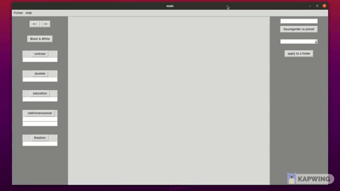

# Projet python modificateur photo ESIEE-IT

Ce fichier résume la construction du projet, ses tenants et aboutissants.

## démo




## Authors

- [@LucasSovre](https://github.com/LucasSovre) (Lucas Sovre)
- [@HenriqueMARTINS9](https://github.com/HenriqueMARTINS9)  (Henrique Martins)
- [@KeroSong](https://github.com/KeroSong)  (Henrique Dong)
## Features

- Transformer une image couleur une image en noir et blanc
- Changer différentes variables d'une image
- Sauvegarder des transformations d'images de manière à faire "un filtre"
- Appliquer "un filtre" à toutes les images .png d'un fichier


## Environment Variables

`Python 3.8 ou supérieur`

`tkinter`

`pillow 8.4.0`

## Installation

Pour utiliser ce projet, clonnez le git puis verifiez que votre Python3 réponds au prérequis de requirement.txt .
Sinon lancez la commande suivante :

```bash
  pip install -r requirement.txt
```

Puis lancer le main depuis la racine du projet.

## Feedback & Question

Pour tout retour ou question n'hésitez pas à contacter un des auteurs à son adresse prenom.nom@edu.esiee-it.fr